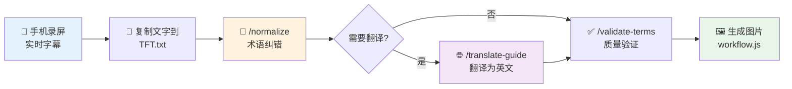
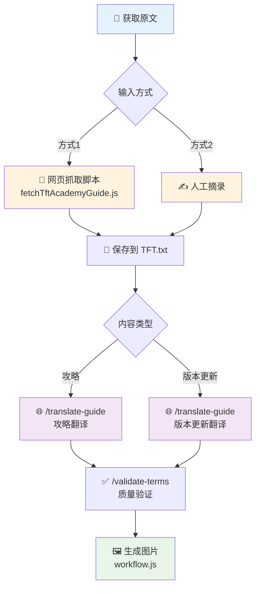

# TFT 攻略处理工具

> 云顶之弈攻略文本规范化与翻译工具

## 🎯 核心功能

本项目专注于**游戏术语纠错**和**翻译处理**，简化工作流，提高效率。

## 🚀 工作流概览

本项目支持两大类工作流：

### 🎙️ 工作流 A：语音识别纠错（手机字幕）

**适用场景**：将游戏讲解视频转为文字攻略

**输入来源**：手机录屏时开启实时字幕功能



```bash
# 1. 复制手机字幕文字到 TFT.txt

# 2. 术语纠错（修正同音字错误）
/normalize

# 3. (可选) 翻译为英文
/translate-guide

# 4. 质量验证
/validate-terms

# 5. 生成图片
node images/workflow.js TFT.md
```

### 🌐 工作流 B：翻译处理

**适用场景**：翻译英文/日文内容为中文

**输入来源**：网页抓取脚本 或 人工摘录

**翻译类型**：
- **攻略翻译**：游戏玩法指导、阵容说明
- **版本更新翻译**：Patch Notes、平衡性调整



```bash
# 方式1: 使用抓取脚本获取原文
node scraper/fetchTftAcademyGuide.js <URL>

# 方式2: 人工摘录到 TFT.txt

# 后续步骤（攻略和版本更新通用）
/translate-guide        # 执行翻译
/validate-terms         # 质量验证
node images/workflow.js TFT.md  # 生成图片
```

## 📂 项目结构

```
.
├── docs/
│   ├── terms/
│   │   └── zh_terms.csv          # 852个标准游戏术语（纠错核心）
├── scraper/                       # 网页抓取工具
├── images/                        # 图片生成工具
├── TFT.txt                        # 输入：原文（字幕/抓取/人工）
└── TFT.md                         # 输出：处理后的攻略
```

## 🛠️ 技能命令

所有命令都以 `/` 开头，在 Claude 对话中直接使用：

**纠错与规范化：**
- `/normalize` - 规范化游戏术语（修正语音识别错误）

**翻译与验证：**
- `/translate-guide` - 翻译攻略（支持攻略和版本更新两种类型）
- `/validate-terms` - 验证翻译质量

## 📜 脚本命令

### 网页抓取
```bash
# 抓取 TFT Academy 攻略（需要提供URL）
node scraper/fetchTftAcademyGuide.js <URL>

# 示例：抓取攻略
node scraper/fetchTftAcademyGuide.js https://tftacademy.com/tierlist/comps/set-15-your-comp
```

### 图片生成
```bash
# 将 Markdown 攻略转换为图片（长图 + 切割）
node images/workflow.js TFT.md
```

## 📊 术语纠错原理

基于 **分层术语处理算法**：

1. **步骤A**: 完全匹配 - 直接识别标准术语
2. **步骤B**: 读音相似度 - 修正同音字错误（核心步骤）
   - "安倍砂" → "安蓓萨"
   - "海哥斯" → "海克斯"
3. **步骤C**: 装备名识别 - 俚语转标准名
   - "羊刀" → "鬼索的狂暴之刃"
4. **步骤D**: 游戏俚语 - 标准化表达
   - "D牌" → "刷新商店"

## 📝 License

MIT
