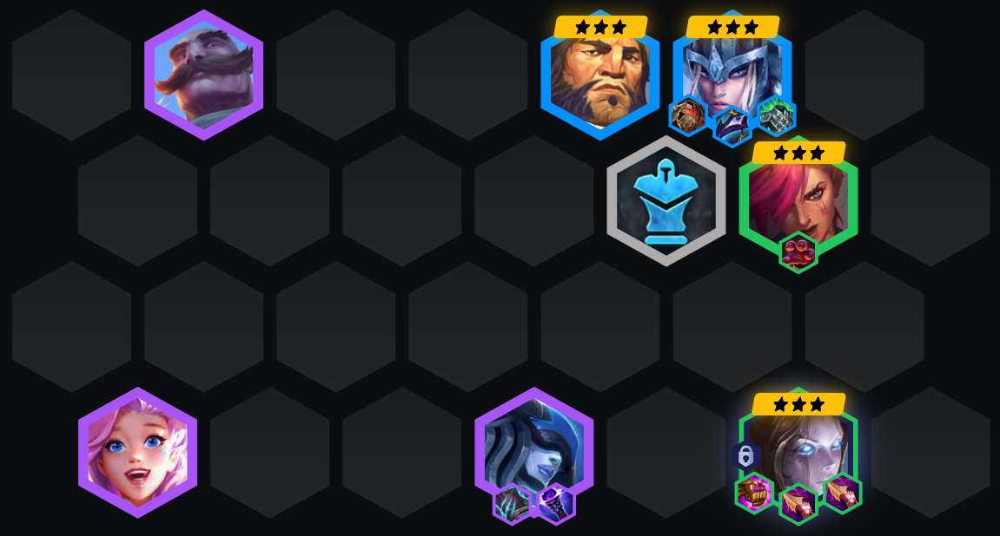
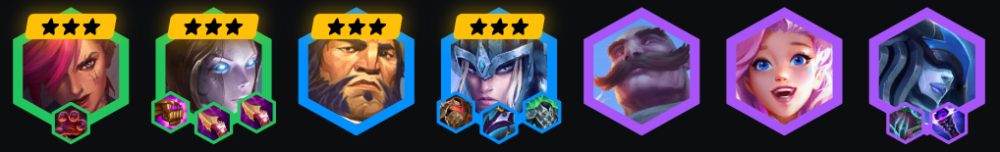
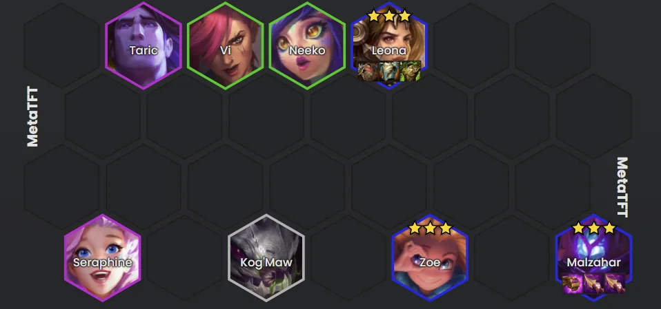

#  慎-奥义！暮临  护卫阵容攻略

## 💡 阵容核心要点

你的主坦克可以是任意3星**护卫**英雄。**慎**依靠AP和魔法抗性输出。

记得一定要玩6护卫。后期用**布隆** + **沃利贝尔**来组成最终阵容。

## 🎯 果实方案
**慎**：战斗力超过9000 / 狂暴渐长 / 双重打击 / 缩角C位

**赵信**：哥斯拉坦克 / 巨像 / 心灵烈焰 / 腐123蚀

## 👑 最终成型
.png>)

## 📈 阶段运营策略

### 🌅 前期运营（2阶段）
**优先给慎做装备**！玩最强的阵容保持连胜。多侦察一下，看看哪个没被抢的**护卫**能当你的主坦克。

### 🔥 中期运营（3阶段）
升级到6级然后开始D牌找2星**慎**。继续找更多的**护卫**或者**刀锋领主**。重新积累经济，然后慢D追3星**慎**。

### ⚡ 后期运营（4阶段）
如果你快到3星**慎**了，可以升到7级继续D牌，同时保持6**护卫**阵容。8级的时候可以上个5费英雄来加强阵容。

## 🎁 强化符文推荐

## 🔄 神器推荐
慎： 烁刃

## 🏆 优先级选择
装备 > 经济 > 战力

## 🎮 前期阵容

## ⚔️ 装备优先级

---

来源: tftacademy