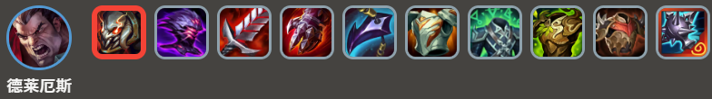
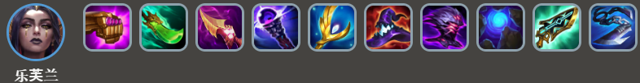
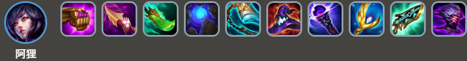
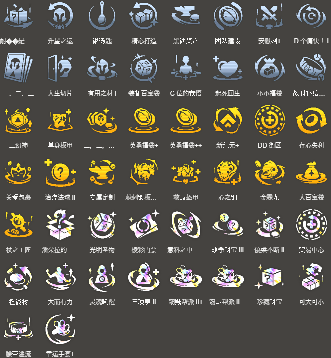

<!-- tags: 赌狗，强势 -->
<!-- cover: dataTFT (4).png -->
<!-- backup: darius-leblanc-ahri -->

# 德莱厄斯 阿狸

## 🎯 概要

3费赌狗阵容。没有经济类强化符文的话完成难度大，但成型后超强力。

3星优先级：**德莱厄斯**=**乐芙兰**=**阿狸**>**凯南**>**可酷伯&悠米**

## ⚡ 前置条件

- 2-1时能用从赛恩那解锁的乐芙兰过渡
- 有珠光护手、纳什之牙等术师装备可以过渡
- 拿到<u>密银黎明</u>（通过便携锻炉、神力天铸等获得）

## ⭐ 最终阵容
.png>)

## 🎒 装备优先级

### 德莱厄斯

### 乐芙兰

### 阿狸

乐芙兰和阿狸的装备相通，推荐用珠光护手、纳什之牙这类装备过渡。

**德莱厄斯**法力锁定时间短，为了连续释放技能，能免疫控制的泰坦的坚决、密银黎明贼强。

而且<u>德莱厄斯每次施法都会提升处决敌人</u>，所以适应性头盔也超猛。

过渡时可以先把适应性头盔给术师，后面再转给德莱厄斯。

## 🔓 解锁条件

**德莱厄斯**: Lv5以上+战斗配置：装备1件装备的德莱文

**乐芙兰**: 战斗配置：装备2件装备的赛恩

**可酷伯&悠米**: Lv6以上+战斗配置：「约德尔人」「斗士」「神谕者」合计星级6

**凯南**: Lv5以上+战斗配置：战斗中「艾欧尼亚」「约德尔人」「护卫」合计星级5

## ⭐ 其他变阵
.png>)

## 🎯 强化符文

来源：tftips
