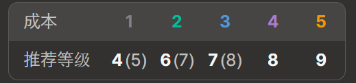
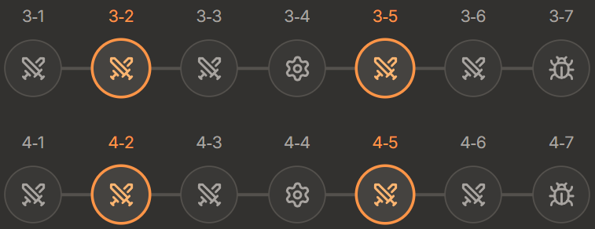

<!-- backup: leveling-tips -->

# 等级小贴士

## 💡 技巧1：在合适的等级D牌

**🤔 什么意思？**

如果你已经决定了想要的棋子，<u>那就先升到特定等级再开始D牌</u>。

**🎯 为什么？**

**在想要的棋子容易出现的等级进行D牌，金币效率更高。**

基本上，玩家等级越高，高费单位就越容易出现在商店里。

## ⚙️ 技巧2：在经验值整数倍回合升级

**🤔 什么意思？**

<u>尽量在3-2、3-5、4-2、4-5等回合升级</u>。

每回合自动获得2点经验值，但升级所需的经验值都是4的倍数。因此，有些回合升级会产生余数，而有些回合则能刚好升级。

**🎯 为什么？**

**金币效率更好。**

**⚡ 要点**

- 如果升级后还能保持50金币利息，那任何回合升级都可以。
- 另外，在连胜等特别想强化阵容的情况下，不用在意这个规则，直接升级。

**来源**: tftips
