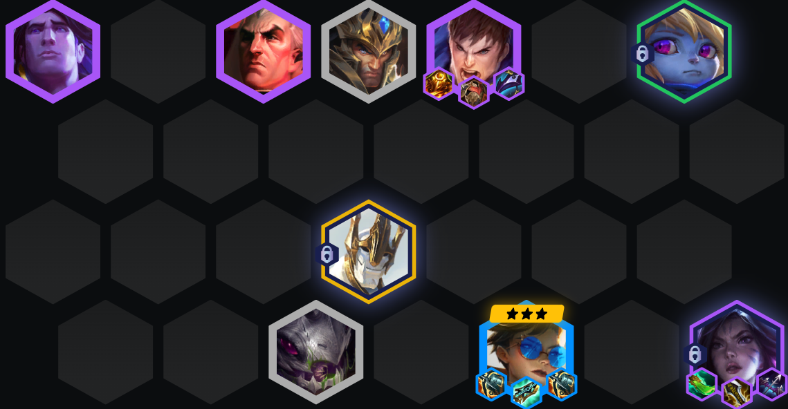

<!-- tags: 推荐新手, 稳定吃分 -->
<!-- cover: image-11.png -->
<!-- backup: longshot-cap -->

# 薇恩 德玛 卡莎

## 🎯 核心思路

这套阵容适合你前期先拿到**薇恩**，并且能围绕**德玛西亚**顺利打出连胜的时候去玩。装备优先级基本是薇恩 > 盖伦 > 卡莎，卡莎虽然更偏物理输出，但实在没得选时也能走法强装。

> <u>8级开出7德玛西亚</u>，后期再根据上限回落到5德玛西亚补强单卡，就是这套阵容的关键转法。

## 🚀 前期构成

## 🎒 装备优先级

## ⭐ 最终阵容

## 🎯 阶段运营

Stage 2：前期围绕薇恩和早早升星的德玛西亚牌去保连胜，<u>拿到物理装备就直接先给薇恩或凯特琳打工</u>。

Stage 3：理想情况是转成5德玛西亚 + 克格莫 + 科加斯。如果你这时还是1星薇恩，但已经开出卡莎，那就<u>直接把装备转给卡莎来撑中期</u>。

Stage 4：<u>4-2升到8级后开搜</u>，目标是把前排、后排和加里奥都补到位。要是薇恩来得特别多，可以考虑追**3星薇恩**；不然就继续上9找**吉格斯**补终极上限。

## 🔄 灵活单位

## 🎯 强化符文

## ⭐ 强化符文优先级
装备 > 经济 > 战力

## 💪 装备备选

来源: tftacademy
