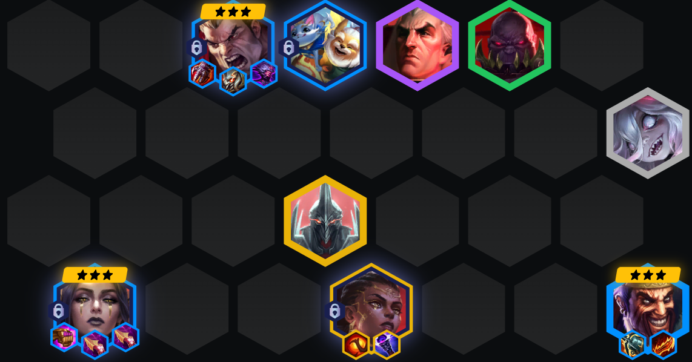
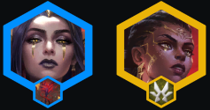
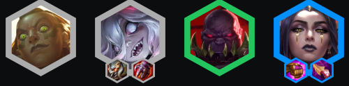
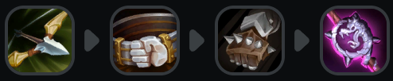
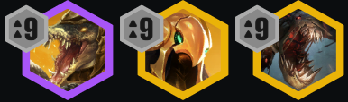

<!-- tags: 赌狗, 吃分 -->
<!-- cover: image.png -->
<!-- backup: noxus-leblanc-atakhan -->

# 德莱厄斯 乐芙兰

## 💡 核心攻略

尽快通过给**塞恩**装备来解锁**乐芙兰**。

<u>装备优先级：乐芙兰 > 德莱厄斯</u>。

停在7级并D3星德莱厄斯、3星乐芙兰,如果够富就连3星德莱文也D出来。

梅尔和斯维因可以拿工具装。

## ⭐ 最终阵容

## 🎯 阶段运营

**二阶段:** 

理想情况下从乐芙兰和**诺克萨斯**开局。没有就用前排战士过渡，直到找到德莱厄斯。

**三阶段:** 

升到6级并尽快上**5诺克萨斯**。你也可以上更多斗士来解锁可酷伯。<u>装备齐全且俩星的德莱厄斯在这个阶段是个怪物</u>。

**四阶段:** 

在7级D3星,上5诺克萨斯+可酷伯。找到安蓓萨后立即解锁梅尔来刷光明装备。8级时上7诺克萨斯,或者上5费卡。

## 🔄 特殊装备

## 🎯 强化符文

## ⭐ 强化符文优先级
装备 > 经济 > 战力

## 🚀 前期构成

## 🎒 装备优先级

## 💪 阵容上限

**来源**: TFT Academy
