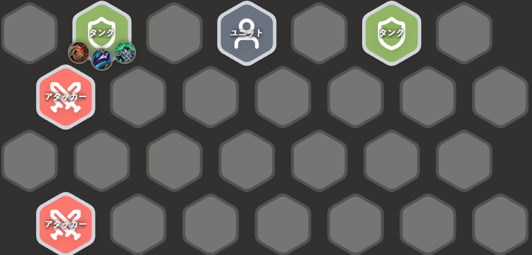
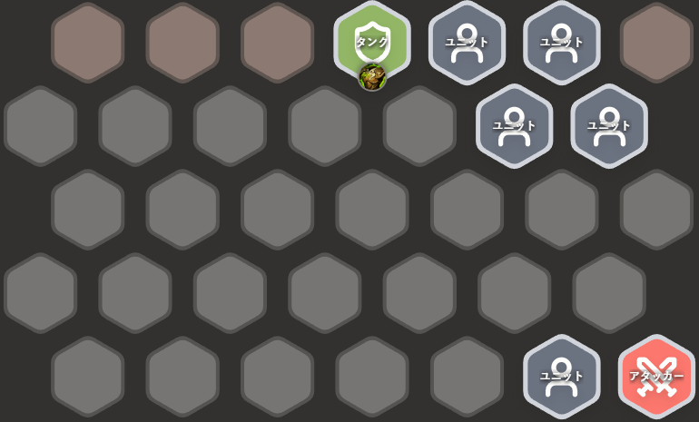

<!-- backup: positioning-tips -->

# 站位技巧

## 🎯 让主坦保护主C

**是什么意思？**

主坦尽量和主C站在同一侧。要是主C是**战士**这类近战单位，主坦也可以直接站在他旁边或前面。

**为什么？**

这样能让最能拖时间的**主坦**先吃到伤害，尽量别让敌人第一时间集火到你的主C。把脆皮单位顶在主C前面，通常也会很快被突破。

> <u>主坦和主C尽量同侧站</u>，核心就是先保住输出位。

## ⚔️ 优先去收掉对手的脆皮单位

**是什么意思？**

特别是在连败过渡时，站位要主动往一边靠，让自己的单位更容易先打到对手的**脆皮单位**，尽量多换掉几只。

**为什么？**

<u>多击杀1个单位，通常就能少掉1点血</u>。如果你从前期就开始这样处理，最后名次往往都会受影响。

**怎么做？**

提前侦察下一轮可能遇到的对手，看看他们的站位，再决定自己这一轮往哪边偏。

来源: tftips
