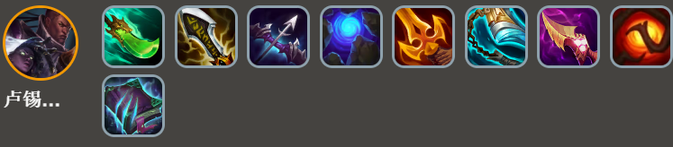
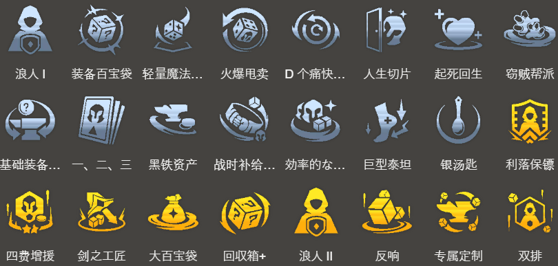
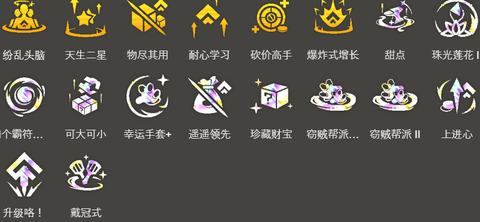

<!-- tags: 登顶阵容 -->
<!-- cover: dataTFT (10).png -->
<!-- backup: tahm-fortune-bilgewater -->

# 塔姆 沃利贝尔 

## 📖 概要

这是一套围绕**比尔吉沃特**羁绊展开的阵容。

核心是**塔姆**的技能与**河流之王**、**比尔吉沃特**的效果叠加起来疯狂提升战力，而且能塞进去的5费英雄选择很多，所以<u>这套阵容拿第一非常容易</u>。

最终阵容固定是：塔姆、厄运小姐、卢锡安与赛娜+1个比尔吉沃特英雄，剩下的位置根据你俩星的5费英雄灵活调整。

## ⭐ 最终阵容
.png>)

## 🎯 前置条件

1阶段拿到崔斯特、诺提勒斯、普朗克其中任何一个时可以玩（也就是2-1能出比尔吉沃特时）

**比尔吉沃特**的机制是越早上场，攒的『银蛇币』越多，所以前期就得赶紧出。

## 💰 银蛇币使用技巧

前期为了尽快出**5比尔吉沃特**，优先买普朗克和诺提勒斯。用银蛇币买英雄来升星也可以。

幸运达布隆金币现在削弱了，不推荐买。

打赢对局攒银蛇币才是关键，所以8级时狂D牌把厄运小姐升到2星。

**7比尔吉沃特**的装备里，酒吧指虎和成堆柑橘这两个坦克装最强。如果想要的装备出现2个了，就可以把比尔吉沃特羁绊降到5。

装备买完后，开始买属性加成。

## ⭐ 变阵
.png>)

## 💡 运营技巧

**河流之王**玩法里，前排扛不住时就加生命值，有余力时就加法术加成，让塔姆的技能直接秒人。

基本上不亏利息的前提下，喂便宜的英雄，阵容成型后再喂贵的英雄。

升星的英雄属性加成效率更高，所以不需要的俄洛伊、格雷福斯、崔斯特、普朗克，如果金币够用就喂给塔姆吧。

## 🎒 装备优先级

**卢锡安与赛娜**

**厄运小姐**

**塔姆**

优先给厄运小姐做物理系装备。

基本上崔斯特和格雷福斯谁俩星了就给谁装备过渡，但注意崔斯特基础攻击力几乎为0，而且没有蓝条，所以朔极之矛、死亡之刃这类装备用不好。

做莫雷洛秘典、红霸符、最后的轻语、无尽之刃时推荐给崔斯特，做朔极之矛、死亡之刃时推荐给格雷福斯。

## 🔓 解锁英雄

**格雷福斯**

解锁条件：战斗中配置装备2件装备的比尔吉沃特英雄

> 如果打算决定玩这套阵容，就在1-4给比尔吉沃特英雄装备2件以上装备,最快速度冲**3比尔吉沃特**。也可以看完2-1的强化符文再决定。

**菲兹**

解锁条件：7级以上+战斗中配置5种约德尔人或比尔吉沃特英雄

**塔姆**

解锁条件：8级以上+比尔吉沃特的银蛇币使用350

**沃利贝尔**

解锁条件：8级以上+战斗中配置生命值3400以上的英雄开始战斗

> 用塔姆的**河流之王**堆生命值，或者在比尔吉沃特商店买最大生命值+4%，就很容易解锁。

## ⭐ 强化符文优先级

> 如果1阶段只掉2个装备，无法解锁格雷福斯，那么装备类强化符文优先级最高。

来源: tftips
