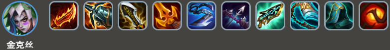
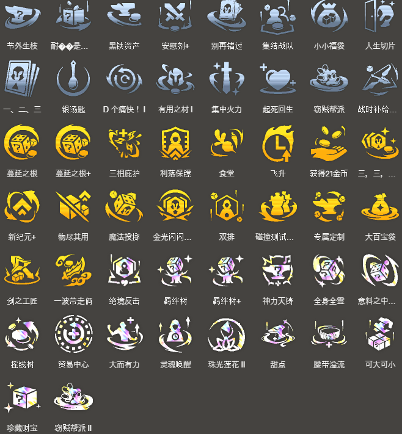

<!-- tags: 稳定，上限高 -->
<!-- cover: dataTFT (8).png -->
<!-- backup: warwick-jinx-comp -->

# 沃里克 辛吉德

## 🎯 阵容概述

**鬼索的狂暴之刃**、**海妖之怒**等射手装备成型时的首选阵容。

**沃里克**和**辛吉德**通过解封机制能有1张保底，<u>即使连败也能轻松转入这套阵容</u>。

纹章装备和神器的适配性非常广，可以进一步提高阵容上限。

## ⭐ 最终阵容
.png>)

## 🔧 前置条件

鬼索的狂暴之刃、海妖之怒等装备过渡时

泰坦的坚决、饮血剑、斯特拉克的挑战护手等装备过渡时

纹章装备(枪手纹章、斗士纹章、护卫纹章、主宰纹章、耀光使纹章、祖安纹章、迅击战士纹章)适配时

## ⭐ 8级过渡
.png>)

## 🎒 装备优先级

**沃里克**

**辛吉德**

**金克丝**

<u>优先把沃里克和金克丝的装备都做出来</u>。

坦克装备按辛吉德>孙悟空>蒙多医生的顺序，给俩星的单位优先装备。

最终**2星千珏**拿到了就把金克丝的装备给她。

如果有**2星吉格斯**的话,推荐把金克丝的鬼索的狂暴之刃、水银等攻速装给他。

## 🔓 解封条件

**沃里克**

7级以上+战斗中配置: 装备1件装备的金克丝、装备1件装备的蔚

大概剩30金币左右的话就升到7级解封。记得提前准备好给蔚和金克丝的装备。

**辛吉德**

4种「祖安」或「主宰」 失去35点玩家生命值

**吉格斯**

9级以上+战斗中配置: 装备2件装备的「约德尔人」或「祖安」

## 🎯 强化符文

来源：tftips
